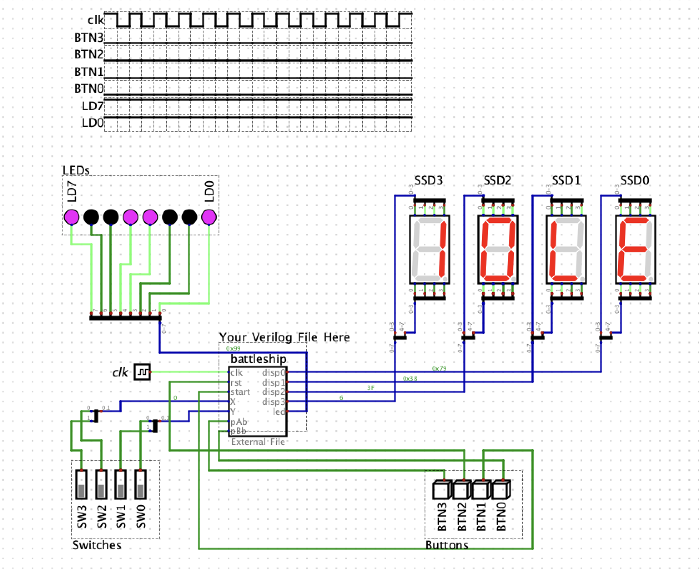

# E-Battleship 3000
A (totally serious) Electronic Battleship game on an FPGA—**because sometimes you just need to sink your classmates’ ships in style**.

---

## Table of Contents
1. [Project Overview](#project-overview)  
2. [Features](#features)  
3. [How It Works](#how-it-works)  
4. [Setup & Usage](#setup--usage)  
5. [Three Rounds, Double the Mayhem](#three-rounds-double-the-mayhem)  
6. [What's in This Repo?](#whats-in-this-repo)  
7. [FPGA Glory Shot](#fpga-glory-shot)  
8. [Contributors](#contributors)  

---

## Project Overview
Welcome to the E-Battleship 3000, a two-player battleship showdown on a 4x4 grid.  
Don’t let the number of squares fool you; it’s still enough space to destroy friendships…er…**compete joyfully**.

We’ve got:  
- Real-time coordinate inputs from switches!  
- Fancy (and sometimes flashy) LED indicators!  
- SSD displays that yell at you when you screw up (“Erro”) and celebrate you when you win!  

This is basically the Hollywood blockbuster of digital logic labs, minus the Oscar awards.

---

## Features
- **Idle Mode**: Because your FPGA deserves a coffee break too.  
- **Ship Placement**: Coordinate inputs (X, Y) with fancy LED confirmations.  
- **Scoring**: Who can sink more ships the fastest (or with style points)?  
- **LED Fireworks**: LEDs light up (or shut off) for each shot. Great for that *“I just sunk your battleship”* victory dance.  
- **Victory Condition**: First player to sink all four ships or best two out of three rounds. Cue confetti here.  

---

## How It Works
1. **Reset / Start**: Press the magical buttons (`rst` / `start`) to let the FPGA know you mean business.  
2. **Ship Placement**:
   - Use switches `[3:0]` to pick X and Y.  
   - Press the correct side button to lock in the coordinates.  
   - Try not to overlap your own ships, or the FPGA will show “Erro” and judge you silently.  
3. **Shooting**:
   - Similar to placing ships, pick X, Y with the switches, then press your button to *fire away*.  
   - If you hit something, lights go **Kaboom** (all LEDs lit), and the scoreboard updates. Otherwise, lights go off in sadness.  
4. **Win Condition**:
   - First to sink 4 ships…or 2 out of 3 games if you want to keep your opponent in tears longer.  

---

## Setup & Usage
1. **Clone this repo** (or fork, or just read it for bedtime stories).  
2. **Open the project** in your favorite Verilog-friendly software.  
3. **Synthesize & Implement** on your FPGA device.  
4. **Flip switches** and press buttons until you sink your opponent’s entire navy.  

> **Tip**: Keep a scoreboard for personal bragging rights.

---

## Three Rounds, Double the Mayhem
- The winner of each round goes first in the next round.  
- First to secure 2 round wins is deemed the **Conqueror of the Seas**.  
- Because one single game wasn’t enough, we needed best-of-three battles just to see you break out in anxious sweats.

---

## What's in This Repo?
- **battleship.v** – The main module that does all the intense logic and eventually demands a pay raise.  
- **battleship_tb.v** – Testbench for simulating your game scenarios (also known as your digital punching bag).  
- **clk_divider.v** – Slows down time from 100 MHz to 50 Hz. Possibly from the future.  
- **debouncer.v** – Tames the wild bouncing push-button signals. We can’t have chaos all the time.  
- **ssd.v** – Makes your seven-segment displays shine bright like a diamond (or a scoreboard).  
- **ASM Chart** – For those times you want to see the game’s flowchart in all its splendid glory.

---

## FPGA Glory Shot
Feast your eyes upon the photographic proof that this project has indeed sailed.  

---

## Contributors
- **Defalt(Me)** – The unstoppable Admiral who coded and conquered.  

May your seas be full of sunken ships (that belong to your opponent, of course). Happy coding!

